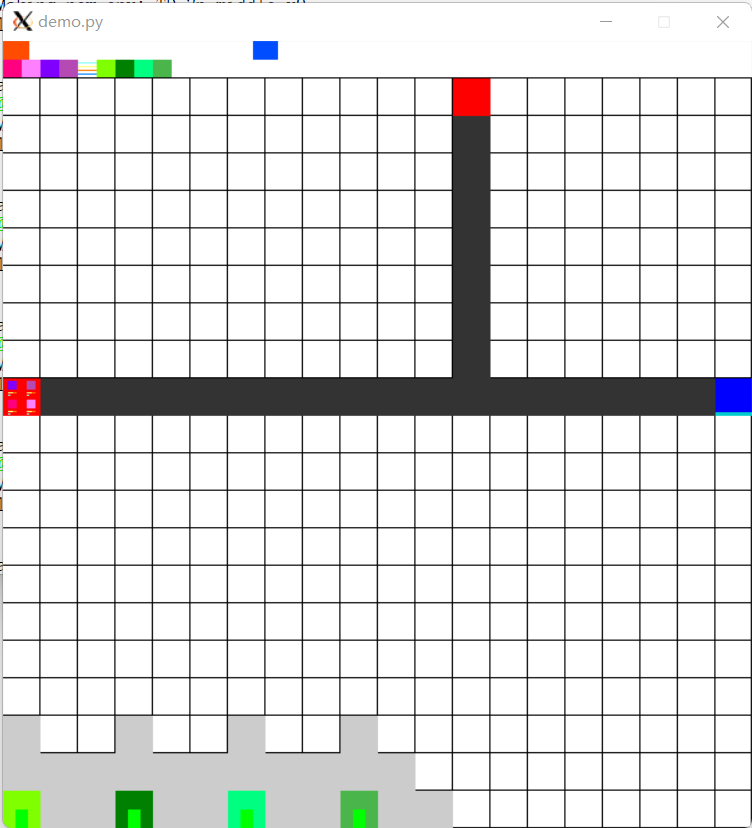

# gym-TD (Gym - Tower Defense)

## Introduction
gym-TD is a simplified Tower Defense game (TD game). Your goal is to build towers to prevent enemies entering your base as long as possible. You can also control the attacker to summon enemies to enter the defender's base as many times as possible.

<kbd></kbd>

### Board
Board is where this game happens. It contains blocks of shape `(length, length)`. The elements is described as follow:
- Bars at the top: Cost bar.
    - Red bar on the left: The cost that the attacker has.
    - Blue bar on the right: The cost that the defender has.
    - Note: Each time the attacker summons a enemy or the defender build/upgrade a tower, some costs will be consumed.
- Little blocks and lines below the bar: legends.
    - Four blocks on the left most: Enemy of type 0-3 respectively
    - Four lines on the middle: from top to bottom:
        - Number of enemies at each position
        - Average life points of enemies at each position
        - Maximum life points of enemies at each position
        - Minimum life points of enemies at each position
    - Four blocks on the right side: Defense tower of type 0-3 respectively
- White square: A empty place where towers could be built on.
- Gray square: The place where towers could not be built on.
- Black square: A part of a path where the enemies will pass. Tower could not be built here either.
- Red square: The start point where the enemies will be summoned.
- Blue square: The base point of defender.
    - Light blue bar: The LP bar of base point.
- Green bar over the towers: Tower level.

### Defender
Defender is the player in most other TD games. Your goal is to build and upgrade your towers, which could automatically attack the enemies, to protect your base point.
- Observation space:
    - An NumPy array of shape (nchannels, length, length)
    - Channels in Map:
        - 0: is road
        - 1: is road 1
        - 2: is road 2
        - 3: is road 3
        - 4: is end point
        - 5: LP ratio of end point
        - 6: is start point 1
        - 7: is start point 2
        - 8: is start point 3
        - 9: distance to end point
        - 10: is tower
        - 11: defender cost
        - 12: attacker cost
        - 13: progress of the game
        - 14: could build tower
        - [15, 15+# tower lv): tower level is [0, # tower lv)
        - [15+# tower lv, 15+# tower lv+# tower type): tower type is [0, # tower type)
        - [15+# tower lv+# tower type, 15+# tower lv+2 # tower type): tower of type could be built
        - [a, a+# enemy type): lowest enemy LP of type [0, # enemy type)
        - [a+# enemy type, a+2 # enemy type): highest enemy LP of type [0, # enemy type)
        - [a+2 # enemy type, a+3 # enemy type): average enemy LP of type [0, # enemy type)
        - [a+3 # enemy type, a+4 # enemy type): number of enemies of type [0, # enemy type)
        - [a+4 # enemy type, a+5 # enemy type): how many enemies could be summoned of type [0, # enemy type)
    - Note: The '# tower lv', '# tower type', '# enemy type', are all specified in configs

- Action space:
    - `hyper_parameters:allow_multiple_actions==True`:
      - Box(low=0, high=1, shape=(# tower types+2, length, length), dtype=np.int64)
      - Channels description:
          - [0, #tower types): Build: Whether to build a tower of that type at this place. (1 for True)
          - #tower types: LvUp: Whether to upgrade the tower at this place.
          - #tower types+1: Destruct: Whether to destruct the tower at this place. Destruction will return some costs spent on this tower.
      - These actions are processed in order (Process Build, LvUp, Destruct in order in one block, and then these actions in another block), which means you could build a tower and upgrade it and then destruct it in a single action, but you could not do the same thing twice in a single action.
    - `hyper_parameters:allow_multiple_actions==False`:
      - Discrete(length * length * (# tower types+2) + 1)
      - The one hot index of the tensor described above, with the last action as doing nothing.

    **Note**: The illegal actions will be ignored.

### Attacker
Your goal is to summon the enemies with some strategy so that as many enemies (creepers) could reach the base point as possible.
- Observation space:
    Same as defender.

- Action space:
    - Box(low=0, high=# enemy types, shape=(max num of roads, max cluster length), dtype=np.int64)
    - The types of enemy summoned in the cluster at each road. # enemy types means do not summon.

### Multi-player
You could control both the defender and attacker.
- Observation space:
    Same as defender.

- Action space:
    A Python dict of this form:
    ```
    {
        "Attacker": "Same to the action space of attacker"
        "Defender": "Same to the action space of defender"
    }
    ```

- Reward:
    The reward that `step` returns is same as the reward that the defender gets. The reward for the attacker is the opposite of the reward for the defender.

### Config
You could config lots of parameters of this game with the function `paramConfig(**kwargs)` to customize your environment. For example, if you want to set the variable `max_cost=100`, all you need is to simply execute `paramConfig(max_cost=100)` before making the environment. You should config parameters before making an environment. You could read [gym_TD/envs/README.md](gym_TD/envs/README.md) for detailed descriptions.

### End condition
This game will run continuously until reaching 1200 steps, or `base_LP` enemies have been leaked (`base_LP=None` means do not end due to leakage). Although you could run even after 1200 steps without error, you are not supposed to do so.

### Versions
- TD-def-small-v0: Control the defender. Map size = (10, 10)
- TD-def-middle-v0: Control the defender. Map size = (20, 20)
- TD-def-large-v0: Control the defender. Map size = (30, 30)
- TD-atk-small-v0: Control the attacker. Map size = (10, 10)
- TD-atk-middle-v0: Control the attacker. Map size = (20, 20)
- TD-atk-large-v0: Control the attacker. Map size = (30, 30)
- TD-2p-small-v0: Control both sides. Map size = (10, 10)
- TD-2p-middle-v0: Control both sides. Map size = (20, 20)
- TD-2p-large-v0: Control both sides. Map size = (30, 30)
----
- TD-def-v0: Control the defender. You should pass the parameter `map_size=n` when making the environment, to set the map size to (n, n)
- TD-atk-v0: Control the attacker. You should pass the parameter `map_size=n` when making the environment, to set the map size to (n, n)
- TD-2p-v0: Control both sides. You should pass the parameter `map_size=n` when making the environment, to set the map size to (n, n)

## Installation
It should work on Python3. It only requires gym and numpy.

Using the commands following could automatically install this package.
```
cd gym-TD
python setup.py install
```

Or you could simply use the following commands to install the prerequisites.
```
cd gym-TD
python -m pip install -r requirements.txt
```

## Demo
```
cd gym-TD
python demo.py
```
You could also use `python demo.py -[adm]` to see a random game. (Use `python demo.py -h` for details)

## Training
You could use gym-TD just like use other OpenAI Gym environments like cartpole. You could go [OpenAI Gym](https://github.com/openai/gym) for example codes and documents.

## Toys
`gym_toys` contains several environments that is designed to test some specific abilities of machine learning agents. Toys requires gym, numpy and scipy.

- `DistributionLearning-v0`:

    Given a distribution Q, the goal is to generate a new distribution P, or a sample from the distribution P, so that the KL divergence D_KL(P||Q) is as large as possible.

    This environment is designed to test the ability of learning the combination of multiple actions, and the ability of learning from samples.

- `DiskRaising-v0`:

    The goal is to raise a disk that is slowly falling on a rod to the top of that rod. Each time taking action will cost some budget, and the more budget that action costs, the more efficient that action is, thus learning to wait is important.

    This environment is designed to test the ability of learning to wait and the ability of exploring actions with restrictions.
